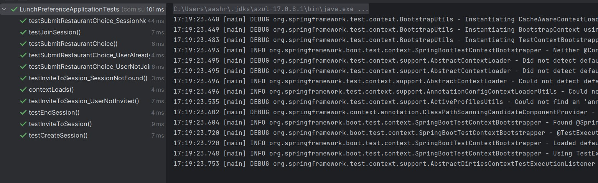

# Lunch preference (pick-restaurant)
Welcome to the documentation for Lunch preference (pick-restaurant). This document provides an overview of the project and instructions on how to use it.

## Swagger API Documentation
We provide API documentation using Swagger, which allows you to explore and test the API endpoints interactively. To access the Swagger documentation, follow these steps:

1. Ensure that the project is running and the API is accessible.
2. Open your web browser and navigate to the Swagger UI page:
   [Swagger UI](http://localhost:8080/swagger-ui/index.html)  
3. You should see the API documentation, where you can view all available endpoints, their descriptions, and test them using the interactive interface.
4. complete steps on creating the session and selecting the restaurant
### Getting Started
This backend version of the lunch-preference application provides REST API endpoints.

### Running lunch-preference API locally
### With maven command line (Set JAVA_HOME if needed)
### Clone the repository:
```
git clone https://github.com/sureshchellaboyina/pick-restaurant.git
cd pick-restaurant
# on linux / macos
./mvnw spring-boot:run
# on windows
mvnw spring-boot:run
```
### API Response

# Create Session
Example:
POST http://localhost:8080/api/lunch/create-session
```json
{
  "teamMember": "suresh", 
  "location": "restaurant", 
  "sessionName": "Lunch Session 1", 
  "initiator": "suresh"
}
```

```Response: Session created successfully ```

# Invite Users to the Session
POST http://localhost:8080/api/lunch/invite?sessionId={sessionId}&users={user1,user2,...}

Example:

POST http://localhost:8080/api/lunch/invite?sessionId=1&users=sam,peter

```Response: sam,peter invited to the session.```

# Joining Session
POST http://localhost:8080/api/lunch/join-session?sessionId={sessionId}&user={user}

Example:
POST http://localhost:8080/api/lunch/join-session?sessionId=1&user=sam

```Response: sam joined the session.```

ErrorResponse: If the user is not invited to join the session but tries to join

Example:
POST http://localhost:8080/api/lunch/join-session?sessionId=1&user=peter

```Response: peter is not invited to the session.```

# Submitting Restaurant Choice
POST http://localhost:8080/api/lunch/submit-restaurant?sessionId={sessionId}&user={user}&restaurant={restaurant-choice}

Example:
POST http://localhost:8080/api/lunch/submit-restaurant?sessionId=1&user=sam&restaurant=Saizeriya

```Response: sam submitted restaurant choice: Saizeriya```

ErrorResponse: If the user is trying to submit a restaurant choice without joining the session

Example:
POST http://localhost:8080/api/lunch/submit-restaurant?sessionId=1&user=peter&restaurant=KFC

```Response: peter is not part of the session and cannot submit a restaurant choice.```

ErrorResponse: If the same user is trying to submit a restaurant choice again

Example:
POST http://localhost:8080/api/lunch/submit-restaurant?sessionId=1&user=sam&restaurant=mcdonald

Response: sam, you have already submitted a restaurant choice for this session.

# Get All Submitted Restaurants
GET http://localhost:8080/api/lunch/get-restaurants?sessionId={sessionId}

Example:
GET http://localhost:8080/api/lunch/get-restaurants?sessionId=1

Response: 
```json
[
"Saizeriya", 
"mcdonald", 
"korean-hotpot",
"Mrprata",
"bananaleaf",
"MrBiryani" 
]
```

# End the Session and Pick a Random Restaurant
POST http://localhost:8080/api/lunch/end-session?sessionId={initiator}&user={initiator}

Example:
POST http://localhost:8080/api/lunch/end-session?sessionId=1&user=Suresh

```Response: Session ended. Selected restaurant: Mrprata```

ErrorResponse: If the user is trying to join a session after it has ended

Example:
POST http://localhost:8080/api/lunch/join-session?sessionId=1&user=raj

```Response: Session has ended and cannot be joined.```

ErrorResponse: If the user is trying to submit a restaurant choice after the session has ended

Example:
POST http://localhost:8080/api/lunch/submit-restaurant?sessionId=1&user=raj&restaurant=kopitiam

```Response: Session has ended, and restaurant choices cannot be submitted.```

# Accessing H2 console ( in-memory database)
   http://localhost:8080/h2-console
# Tables and Sqls
   ```
   select * from LUNCH_PREFERENCE
   select * from LUNCH_PREFERENCE_INVITED_USERS
   select * from LUNCH_PREFERENCE_JOINED_USERS
   select * from LUNCH_PREFERENCE_RESTAURANT_CHOICES
   select  *  from LUNCH_PREFERENCE_SUBMITTED_USERS 
   
   ```

# Test Results


# Test Results
